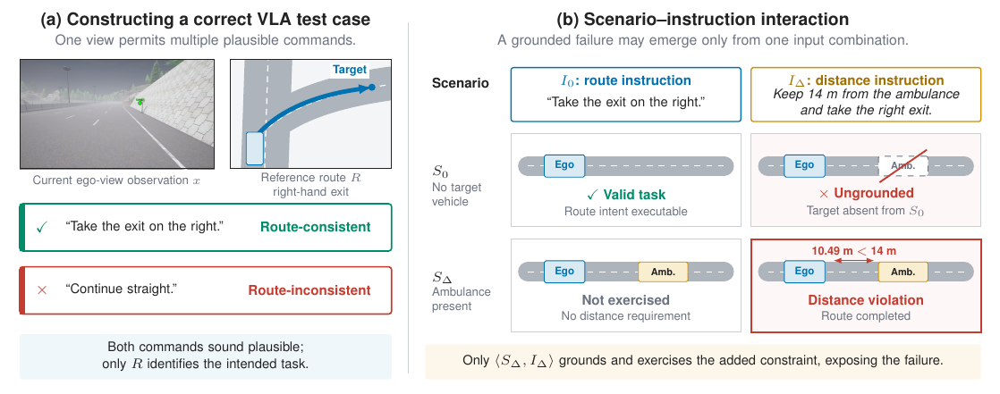

# VLAD-Fuzz

**VLAD-Fuzz is a testing framework for finding failures in
language-conditioned autonomous-driving systems.** It constructs executable
driving tasks in CARLA, generates route-grounded natural-language
instructions, and jointly explores dynamic scenarios and instruction variants
against a selected vision-language-action (VLA) driving model.

VLAD-Fuzz currently supports three closed-loop driving systems:
[LMDrive](https://github.com/opendilab/LMDrive),
[SimLingo](https://github.com/RenzKa/simlingo), and
[BEVDriver](https://github.com/Intelligent-Vehicles-Lab-HM/BEVDriver). The
framework keeps scenario construction, execution, mutation, failure oracles,
and result recording shared across all backends.

<p align="center">
  
</p>

<p align="center"><sub>
VLAD-Fuzz first constructs route-grounded VLA driving tasks, then coordinates
global scenario search with local language fuzzing through closed-loop
execution feedback.
</sub></p>

## What VLAD-Fuzz Does

A VLA driving test case contains more than a road layout: its natural-language
instruction is an executable input that can change the model's behavior.
VLAD-Fuzz tests both parts of that input space:

<p align="center">
  
</p>

<p align="center"><sub>
The reference route disambiguates the intended navigation task, while valid
language constraints depend on the entities instantiated in the scenario.
</sub></p>

- **Route-grounded test-case generation** selects a feasible CARLA route,
  summarizes its maneuvers, and combines that route prior with an ego-view
  image to generate a natural driving instruction.
- **Global Scenario Search** evolves weather and traffic-participant
  configurations using closed-loop safety and task feedback.
- **Local Language Fuzzing** explores controlled instruction transformations,
  including paraphrasing, irrelevant conversation, speed constraints, and
  vehicle-distance constraints.
- **Failure analysis** detects collisions, prohibited lane crossings,
  test-region departures, destination non-completion, and violations of
  generated speed or distance constraints.

The resulting workflow is:

```text
CARLA road region
  -> verified start and destination candidates
  -> dynamic scenario and feasible route
  -> route-grounded natural-language instruction
  -> coordinated scenario and instruction fuzzing
  -> failure-inducing test cases and execution records
```

## Supported Backends

Each backend has an independent Conda environment because its PyTorch, CUDA,
and model dependencies differ. Install only the environment you need.

| Backend | Conda environment | PyTorch CUDA build | Model preparation |
|---|---|---|---|
| LMDrive | `vlad-lmdrive` | CUDA 11.8 | Automatic from pinned Hugging Face releases |
| SimLingo | `vlad-simlingo` | CUDA 12.8 | Automatic from pinned Hugging Face releases |
| BEVDriver | `vlad-bevdriver` | CUDA 11.8 | Base model automatic; two checkpoints downloaded manually |

Model weights and CARLA binaries are not stored in this repository. Download
instructions, pinned revisions, expected paths, and checkpoint hashes are in
[`docs/MODEL_ASSETS.md`](docs/MODEL_ASSETS.md).

## Requirements

VLAD-Fuzz targets:

- x86-64 Linux (Ubuntu 22.04 is the reference platform);
- at least one CUDA-capable NVIDIA GPU;
- a complete NVIDIA driver with CUDA and Vulkan support;
- [CARLA 0.9.15](https://github.com/carla-simulator/carla/releases);
- Conda or Mamba;
- sufficient GPU memory and disk space for the selected backend;
- a DeepSeek or Gemini API key for language mutation;
- a DashScope API key only when generating new route-grounded instructions.

Desktop and headless Linux systems are supported. A headless server must use
CARLA's off-screen renderer because the tested models still require camera
images. CARLA's no-rendering mode is not suitable.

See [`docs/INSTALL.md`](docs/INSTALL.md) for NVIDIA/Vulkan checks, CARLA setup,
headless rendering, multi-GPU configuration, and backend-specific environment
details.

## Installation

The following example installs the SimLingo backend. Replace `simlingo` and
`vlad-simlingo` with `lmdrive`/`vlad-lmdrive` or
`bevdriver`/`vlad-bevdriver` to use another backend.

### 1. Install CARLA 0.9.15

Download and extract the CARLA 0.9.15 packaged release, including the
additional maps required by your scenarios. Confirm that the installation
contains `CarlaUE4.sh` and `VERSION`.

Before continuing, verify both the compute and graphics stacks:

```bash
nvidia-smi
vulkaninfo --summary
```

### 2. Create a backend environment

From the repository root:

```bash
conda env create -f environments/simlingo.yml
conda activate vlad-simlingo
```

The YAML files are the authoritative dependency specifications. Do not install
an additional top-level requirements file over these environments.

### 3. Configure local paths and credentials

```bash
cp .env.example .env
```

Edit `.env` and set at least:

```bash
CARLA_ROOT=/absolute/path/to/CARLA_0.9.15
VLADFUZZ_CARLA_MODE=offscreen
VLADFUZZ_MODEL_HOME=./models
DEEPSEEK_API_KEY=your_key_here
```

Use `VLADFUZZ_CARLA_MODE=windowed` for desktop debugging. Add
`DASHSCOPE_API_KEY` when generating new instructions, or `GEMINI_API_KEY` when
selecting Gemini as the mutation provider. `.env` is ignored by Git; no
project settings need to be added to `~/.bashrc`.

### 4. Download and validate model assets

```bash
python scripts/prepare_models.py \
  --backend simlingo \
  --accept-model-licenses

python tools/check_environment.py --model simlingo
```

The preparation command downloads from pinned official releases and validates
required assets. BEVDriver requires two manual checkpoint downloads before
validation; see [`docs/MODEL_ASSETS.md`](docs/MODEL_ASSETS.md).

## First Run

The repository includes ready-to-run test inputs, so the first fuzzing run does
not require regenerating scenarios or calling the instruction-generation API.
Start CARLA, run a short VLAD-Fuzz campaign, and stop CARLA afterward:

```bash
scripts/carla_manager.sh start

MODEL=simlingo \
MANIFEST_ID=town01_t_junction_1/seed_1 \
TIME_BUDGET_MINUTES=10 \
scripts/run_vladfuzz.sh

scripts/carla_manager.sh stop
```

The run uses the bundled manifest at `configs/experiment_manifest.jsonl` and
writes execution metadata, checkpoints, and discovered failures under:

```text
results/rq2/runs/vladfuzz/
```

For a longer run, increase `TIME_BUDGET_MINUTES`. The paper configuration uses
240 minutes per model and task. The launcher also exposes population size,
mutation depth, NPC-count range, random seed, LLM provider, and oracle settings
as environment-variable overrides; see `scripts/run_vladfuzz.sh` for their
defaults.

## Build New Test Cases

VLAD-Fuzz can construct a new test corpus from CARLA rather than using the
bundled inputs:

```bash
# Start CARLA in the mode configured by .env.
scripts/carla_manager.sh start

# Build one verified static road region.
SCENARIO_ID=town01_t_junction_1 \
  scripts/generate_static_scenarios.sh

# Select dynamic start/destination seeds and capture ego-view images.
MODEL=simlingo \
STATIC_SCENARIO=static_scenarios/town01_t_junction_1.json \
SEEDS_PER_SCENARIO=5 \
  scripts/generate_seeds.sh

# Generate route-prior-guided instructions. This requires DASHSCOPE_API_KEY.
SEEDS_ROOT=test_cases MODE=route_prior NUM_COMMANDS=1 \
  scripts/generate_instructions.sh

# Link scenarios, routes, images, and instructions into a run manifest.
scripts/build_manifest.sh

scripts/carla_manager.sh stop
```

To define a new road region, add its CARLA map coordinates to a JSONL region
file and pass it through `REGIONS`. The schema, visualization outputs, and
coordinate tools are documented in
[`docs/STATIC_SCENARIOS.md`](docs/STATIC_SCENARIOS.md).

For a one-command small pipeline that performs construction and fuzzing for a
single region:

```bash
MODEL=simlingo \
SCENARIO_ID=town01_t_junction_1 \
TIME_BUDGET_MINUTES=10 \
  scripts/run_pipeline.sh
```

This complete pipeline requires both `DASHSCOPE_API_KEY` for instruction
generation and the configured language-mutation provider key.

## Other Testing Workflows

VLAD-Fuzz ships the comparison and ablation workflows used with the same VLA
backends and shared failure criteria:

| Workflow | Entry point | Default output |
|---|---|---|
| Full VLAD-Fuzz | `scripts/run_vladfuzz.sh` | `results/rq2/runs/vladfuzz/` |
| Random scenario testing | `scripts/run_random.sh` | `results/rq2/runs/random/` |
| Instruction counterfactuals | `scripts/run_instruction_counterfactual.sh` | `results/rq2/runs/instruction_counterfactual/` |
| Adapted DriveFuzz | `scripts/run_drivefuzz.sh` | `results/rq2/runs/drivefuzz/` |
| Component ablations | `scripts/run_rq3.sh` | `results/rq3/runs/` |

Batch variants are available as `scripts/run_batch_*.sh`. The adapted
DriveFuzz source, VLA adapter, and aligned failure checks are included under
`baselines/drivefuzz/`; see [`docs/BASELINES.md`](docs/BASELINES.md).

## Repository Structure

```text
backends/                 LMDrive, SimLingo, and BEVDriver integrations
baselines/                adapted comparison methods, including DriveFuzz
scenario/                 shared closed-loop CARLA execution and metrics
scenario_construction/    road regions, dynamic seeds, routes, and instructions
vladfuzz_runtime/         model registry, mutations, oracles, and run metadata
vladfuzz_workflows/       fuzzing, single-run, baseline, and ablation workflows
scripts/                  supported command-line entry points
configs/                  model assets, road regions, and experiment manifests
environments/             backend-specific Conda environments
artifact_inputs/          versioned scenarios and test cases used in the paper
evaluation/               RQ-specific analysis and reporting programs
tools/                    validation and repository utilities
leaderboard/              vendored CARLA Leaderboard code
scenario_runner/          vendored CARLA ScenarioRunner code
```

Generated scenarios, model assets, and results are intentionally ignored by
Git. The shared architecture and backend boundaries are described in
[`docs/ARCHITECTURE.md`](docs/ARCHITECTURE.md).

## Reproducing the Paper Evaluation

The project can be used independently of the paper evaluation. For exact
experimental reproduction, the repository additionally provides:

- frozen static scenarios and dynamic test inputs under `artifact_inputs/`;
- fixed RQ2 and RQ3 manifests under `configs/`;
- matched random, Instruction-CF, and DriveFuzz workflows;
- analysis programs under `evaluation/rq1/` through `evaluation/rq4/`;
- scripts that summarize generated runs under `results/rq*/`.

Precomputed result archives are not required to run VLAD-Fuzz and are not
currently stored in the source repository. See
[`docs/WORKFLOW.md`](docs/WORKFLOW.md) for the complete construction, batch,
baseline, ablation, and analysis workflow.

## Documentation

- [Installation and system setup](docs/INSTALL.md)
- [Model downloads and expected directory tree](docs/MODEL_ASSETS.md)
- [End-to-end workflow](docs/WORKFLOW.md)
- [Creating built-in and custom road regions](docs/STATIC_SCENARIOS.md)
- [Architecture and backend integration](docs/ARCHITECTURE.md)
- [Baseline implementations](docs/BASELINES.md)
- [Contributing](CONTRIBUTING.md)
- [Third-party code and licenses](THIRD_PARTY.md)

## Contributing

Contributions should preserve the shared execution and search framework.
Model-specific code belongs under `backends/<name>/`, while new backends are
registered in `vladfuzz_runtime/model_registry.py` and receive their own Conda
environment. See [`CONTRIBUTING.md`](CONTRIBUTING.md) for repository rules and
validation commands.

## License and Citation

Bundled third-party components retain their upstream licenses; see
[`THIRD_PARTY.md`](THIRD_PARTY.md). Project-level license and citation metadata
will be finalized before the public release.
